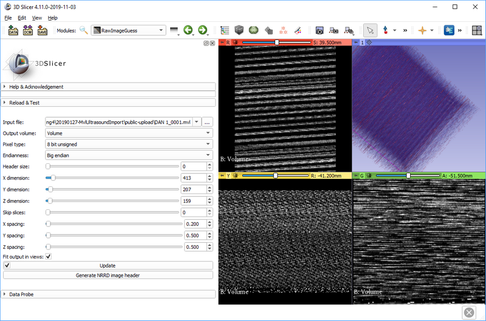
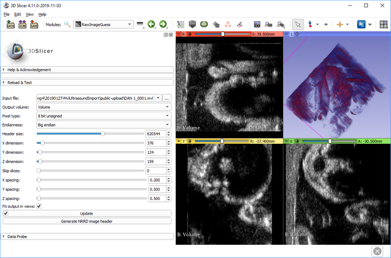

# SlicerRawImageGuess

Extension that helps with loading an image in an unknown image format into 3D Slicer.

Short video tutorial on YouTube: https://youtu.be/ajpOQEAyWkA

How to use:
- Install RawImageGuess extension using Extension Manager in 3D Slicer
- Switch to "Raw Image Guess" module
- Select input file
- Try to guess image parameters based on any information available about the image
- Click Update to see preview of the image that can be loaded
- Experiment with image parameters (click the checkbox on Update button to automatically update output volume when any parameter is changed)
  - Move "X dimension" slider until straight image columns appear (if image columns are slightly skewed then it means the value is close to the correct value), try with different endianness and pixel type values if no "X dimension" value seems to make sense.
  - Move "Header size" until the first row of the image appears on top
  - If loading a 3D volume: set "Z dimension" slider to a few ten slices to make it easier to see when Y dimension value is correct
  - Move "Y dimension" slider until last row of the image appears at the bottom
  - If loading a 3D volume: Move "Z dimension" slider until all the slices of the image are included
- When the correct combination of parameters is found then either save the current output volume or click "Generate NRRD header" to create a header file that can be loaded directly into Slicer

Notes:
- To increase number of decimal digits in a numeric input box, click <kbd>Ctrl</kbd> + <kbd>+</kbd>.

## Example

Before finding the correct image parameters:

After finding the correct image parameters:

